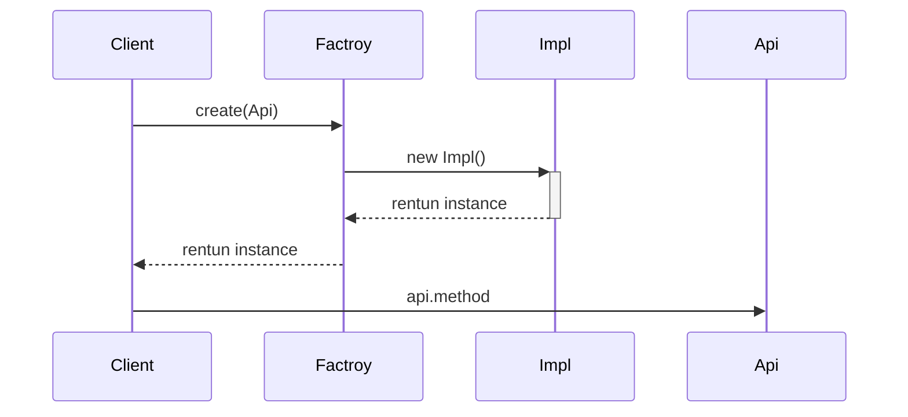

> https://www.jianshu.com/nb/4583287

## 7个原则

- 单一职责原则【SINGLE RESPONSIBILITY PRINCIPLE】: 一个类负责一项职责。
- 里氏替换原则【LISKOV SUBSTITUTION PRINCIPLE】: 继承与派生的规则。
- 依赖倒置原则【DEPENDENCE INVERSION PRINCIPLE】: 高层模块不应该依赖低层模块，二者都应该依赖其抽象；抽象不应该依赖细节；细节应该依赖抽象。
即针对接口编程，不要针对实现编程。
- 接口隔离原则【INTERFACE SEGREGATION PRINCIPLE】: 
- 建立单一接口，不要建立庞大臃肿的接口，尽量细化接口，接口中的方法尽量少。
- 迪米特法则【LOW OF DEMETER】: 低耦合，高内聚。
- 开闭原则【OPEN CLOSE PRINCIPLE】: 一个软件实体如类、模块和函数应该对扩展开放，对修改关闭。
- 组合/聚合复用原则【Composition/Aggregation Reuse Principle(CARP) 】: 尽量使用组合和聚合少使用继承的关系来达到复用的原则。

## 24设计模式

### 创建型

- 单例模式
- 简单工厂
- 工厂方法
- 抽象工厂
- 生成器
- 原型模式

### 结构型

- 外观
- 适配器
- 桥接
- 组合
- 装饰
- 享元
- 代理

### 行为型

- 责任链
- 策略
- 模板方法
- 命令模式
- 观察者
- 访问者
- 状态
- 解释器
- 迭代器
- 中介者
- 备忘录

---

## 创建型模式

---

- 单例模式【Singleton Pattern】:确保一个类只有一个实例，并提供该实例的全局访问点
- 简单工厂【Simple Factory Pattern】: 由一个工厂对象决定创建出哪一种产品类的实例

### 单例模式

- 双重校验锁实现

`volatile`关键字的作用是确保多个线程正确处理某个共享的变量，确保当 uniqueInstance 被初始化为新的 Singleton 实例时，所有线程能够立即看到这个变化。

```java
public class Singleton {

    private volatile static Singleton uniqueInstance;

    private Singleton() {
    }

    public static Singleton getUniqueInstance() {
        if (uniqueInstance == null) {
            synchronized (Singleton.class) {
                if (uniqueInstance == null) {
                    uniqueInstance = new Singleton();
                }
            }
        }
        return uniqueInstance;
    }
}
```

- 枚举类方式实现

```java
public enum Singleton {
    uniqueInstance;
}
```

枚举类方式实现方式是单例模式的最佳实现：
  - 线程安全：枚举类在实例加载时初始化，因此线程安全。
  - 防止反序列化时创建新的对象：枚举类默认继承了`java.io.Serializable`接口，因此枚举类在序列化和反序列化时不会创建新的对象。
  - 防止反射攻击：枚举类的构造函数是私有的，因此无法通过反射调用构造函数创建新的对象。

- 静态内部类实现

```java
public class Singleton {

    private Singleton() {
    }

    private static class SingletonHolder {
        private static final Singleton INSTANCE = new Singleton();
    }

    public static Singleton getUniqueInstance() {
        return SingletonHolder.INSTANCE;
    }
}
```

- 延迟加载：只有在调用`getUniqueInstance`方法时才会加载`SingletonHolder`类，才会创建`Singleton`实例。但这种方式并不是完美的，如果一个类的实例化非常耗时，那么在首次调用`getUniqueInstance`方法时会有一定的延迟。
- 线程安全：Java 中对类的初始化在多线程环境下是线程安全的。
- 防止反序列化和反射攻击：由于`SingletonHolder`类没有外部引用，因此无法通过反序列化或者反射来创建新的实例，从而避免了反序列化和反射攻击。


> 使用双重校验锁实现`public class Singleton`类是公有的，可以通过反射获取到该类的构造函数，将其设为`public`从而创建新的实例。具体如下：

  ```java
  public static void main(String[] args) {
        try {
            // 获取 Singleton 类的构造函数对象
            Constructor<Singleton> constructor = Singleton.class.getDeclaredConstructor();
            
            // 将构造函数设置为可访问
            constructor.setAccessible(true);
            
            // 使用构造函数创建新的 Singleton 实例
            Singleton instance = constructor.newInstance();
        } catch (Exception e) {
            e.printStackTrace();
        }
    }
  ```

  而使用静态内部类实现，类`private static class SingletonHolder`是私有的，无法通过反射获取到该类的构造函数，因此无法通过反射创建新的实例。

### 简单工厂

> [https://www.jianshu.com/p/a9f397c4ff98](https://www.jianshu.com/p/a9f397c4ff98)

在创建一个对象时不向客户端暴露内部细节，并提供一个创建对象的通用接口。将对象的实例化全部放到一个类中来操作。

- 定义接口

```java
/**
   * 接口的定义，该接口可以通过简单工厂来创建
   */  
public interface Api {  
     /**
      * 示意，具体的功能方法的定义
      * @param s 示意，需要的参数
      */  
     public void operation(String s);  
}  
```

- 接口实现类

```java
/**
   * 接口的具体实现对象A
   */  
public class ImplA implements Api{  
     public void operation(String s) {  
         //实现功能的代码，示意一下  
         System.out.println("ImplA s=="+s);  
     }  
}  

/**
   * 接口的具体实现对象B
   */  
public class ImplB implements Api{  
     public void operation(String s) {  
         // 实现功能的代码，示意一下  
         System.out.println("ImplB s=="+s);  
     }  
}  
```

- 工厂类，用来创造Api对象
```java
public class Factory {  
     /**
      * 具体的创造Api对象的方法
      * @param condition 示意，从外部传入的选择条件
      * @return 创造好的Api对象
      */  
     public static Api createApi(int condition){  
         //应该根据某些条件去选择究竟创建哪一个具体的实现对象，  
         //这些条件可以从外部传入，也可以从其它途径获取。  
         //如果只有一个实现，可以省略条件，因为没有选择的必要。  

         //示意使用条件  
         Api api = null;  
         if(condition == 1) {  
             api = new ImplA();  
         } else if(condition == 2) {  
             api = new ImplB();  
         }  
         return api;  
     }  
}  
```

- 客户端，使用Api接口
```java  
public class Client {  
     public static void main(String[] args) {  
         //通过简单工厂来获取接口对象  
         Api api = Factory.createApi(1);  
         api.operation("正在使用简单工厂");  
     }  
}  
```



### 工厂方法

> https://www.jianshu.com/p/f1960652b64b

父类在不知道方法具体实现的情况下完成方法调用，具体方法实现由子类完成

实现步骤：

1. 定义工厂类（父类）：父类通常是一个抽象类，也可以是interface或class，包含工厂方法，即每个产品都需要实现的方法（默认方法）。
2. 工厂类中的产品的具体实现。


一个具体的例子

- 定义工厂

```java
/**
 * 导出的文件对象的接口
 */
public interface ExportFileApi {
   /**
    * 导出内容成为文件
    * @param data 示意：需要保存的数据
    * @return 是否导出成功
    */
   public boolean export(String data);
}
```

- 定义工厂要生产的具体内容（方法的具体实现）

```java
/**
   * 导出成文本文件格式的对象
   */
public class ExportTxtFile implements ExportFileApi{
      public boolean export(String data) {
          //简单示意一下，这里需要操作文件
          System.out.println("导出数据"+data+"到文本文件");
          return true;
      }
}

/**
   * 导出成数据库备份文件形式的对象
   */
public class ExportDB implements ExportFileApi{
      public boolean export(String data) {
          //简单示意一下，这里需要操作数据库和文件
          System.out.println("导出数据"+data+"到数据库备份文件");
          return true;
      }
}
```

- 创建器，用于创建工厂生产内容的实现

```java
/**
   * 实现导出数据的业务功能对象
   */
public abstract class ExportOperate {
      /**
       * 导出文件
       * @param data 需要保存的数据
       * @return 是否成功导出文件
       */
      public boolean export(String data){
          //使用工厂方法
          ExportFileApi api = factoryMethod();
          return api.export(data);
      }
      /**
       * 工厂方法，创建导出的文件对象的接口对象
       * @return 导出的文件对象的接口对象
       */
      protected abstract ExportFileApi factoryMethod();
}
```

- 创建器的具体实现

```java
/**
   * 具体的创建器实现对象，实现创建导出成文本文件格式的对象
   */
public class ExportTxtFileOperate extends ExportOperate{
      protected ExportFileApi factoryMethod() {
          //创建导出成文本文件格式的对象
          return new ExportTxtFile();
      }
}

/**
   * 具体的创建器实现对象，实现创建导出成数据库备份文件形式的对象
   */
public class ExportDBOperate extends ExportOperate{
      protected ExportFileApi factoryMethod() {
          //创建导出成数据库备份文件形式的对象
          return new ExportDB();
      }
}
```

- 使用

```java
public class Client {
      public static void main(String[] args) {
          //创建需要使用的Creator对象
          ExportOperate operate = new ExportDBOperate();
          //调用输出数据的功能方法
          operate.export("测试数据");
      }
}
```


### 抽象工厂

> [https://www.jianshu.com/p/e873855e88a0](https://www.jianshu.com/p/e873855e88a0)

提供一个创建一系列相关或相互依赖的对象的接口，而无需指定具体的实现类。抽象工厂需要在工厂内部需要定义关系，这也是工厂方法和抽象工厂的区别，从而实现对产品的组装，对外只提供具体的产品。


总体步骤：

1. 定义产品类型
   - 产品类型
   - 每种类型产品的具体型号
2. 定义工厂
   - 工厂生产多种类型的产品，此处不区分具体型号，只区分类别
3. 生产产品
   - 使用多种产品类型的具体信号，组装出产品
4. 供应商
   - 供应工厂产出的产品
5. 消费者
   - 从供应商处获取产品


- 产品类型I

```java
/** 
   * CPU的接口 
   */  
public interface CPUApi {  
      /** 
       * 示意方法，CPU具有运算的功能 
       */  
      public void calculate();  
}  

/** 
   * Intel的CPU实现 
   */  
public class IntelCPU implements CPUApi{  
      /** 
       * CPU的针脚数目 
       */  
      private int pins = 0;  
      /** 
       * 构造方法，传入CPU的针脚数目 
       * @param pins CPU的针脚数目 
       */  
      public IntelCPU(int pins){  
          this.pins = pins;  
      }  
      public void calculate() {  
          System.out.println("now in Intel CPU,pins="+pins);  
      }  
}  

/** 
   * AMD的CPU实现 
   */  
public class AMDCPU implements CPUApi{  
      /** 
       * CPU的针脚数目 
       */  
      private int pins = 0;  
      /** 
       * 构造方法，传入CPU的针脚数目 
       * @param pins CPU的针脚数目 
       */  
      public AMDCPU(int pins){  
          this.pins = pins;  
      }  
      public void calculate() {  
          System.out.println("now in AMD CPU,pins="+pins);  
      }  
}  
```

- 产品类型II
```java
/**
   * Mainboard的接口
   */
public interface MainboardApi {
     public void installCPU();
}

/** 
   * 技嘉的主板 
   */  
public class GAMainboard implements MainboardApi {  
      /** 
       * CPU插槽的孔数 
       */  
      private int cpuHoles = 0;  
      /** 
       * 构造方法，传入CPU插槽的孔数 
       * @param cpuHoles CPU插槽的孔数 
       */  
      public GAMainboard(int cpuHoles){  
          this.cpuHoles = cpuHoles;  
      }  
      public void installCPU() {  
          System.out.println("now in GAMainboard,cpuHoles=" + cpuHoles);  
      }  
}  

/** 
   * 微星的主板 
   */  
public class MSIMainboard implements MainboardApi{  
      /** 
       * CPU插槽的孔数 
       */  
      private int cpuHoles = 0;  
      /** 
       * 构造方法，传入CPU插槽的孔数 
       * @param cpuHoles CPU插槽的孔数 
       */  
      public MSIMainboard(int cpuHoles){  
          this.cpuHoles = cpuHoles;  
      }  
      public void installCPU() {  
          System.out.println("now in MSIMainboard,cpuHoles=" + cpuHoles);  
      }
}  
```

- 定义工厂，工厂使用使用产品类型I和II组装出完整的产品

```java
/** 
   * 抽象工厂的接口，声明创建抽象产品对象的操作 
   */  
public interface AbstractFactory {  
      /** 
       * 创建CPU的对象 
       * @return CPU的对象 
       */  
      public CPUApi createCPUApi();  
      /** 
       * 创建主板的对象 
       * @return 主板的对象 
       */  
      public MainboardApi createMainboardApi();  
}  
```

- 工厂生产具体产品

```java

/** 
   * 装机方案一：Intel 的CPU + 技嘉的主板 
   * 这里创建CPU和主板对象的时候，是对应的，能匹配上的 
   */  
public class Schema1 implements AbstractFactory{  
      public CPUApi createCPUApi() {  
          return new IntelCPU(1156);  
      }  
      public MainboardApi createMainboardApi() {  
          return new GAMainboard(1156);  
      }    
}  

/** 
   * 装机方案二：AMD的CPU + 微星的主板 
   * 这里创建CPU和主板对象的时候，是对应的，能匹配上的 
   */  
public class Schema2 implements AbstractFactory{  
      public CPUApi createCPUApi() {  
          return new AMDCPU(939);  
      }  
      public MainboardApi createMainboardApi() {  
          return new MSIMainboard(939);  
      }    
}
```
- 供应商，提供工厂生产的产品

```java
/** 
   * 装机工程师的类 
   */  
public  class ComputerEngineer {  
      /** 
       * 定义组装机器需要的CPU 
       */  
      private CPUApi cpu= null;  
      /** 
       * 定义组装机器需要的主板 
       */  
      private MainboardApi mainboard = null;  

      /** 
       * 装机过程 
       * @param schema 客户选择的装机方案 
       */  
      public void makeComputer(AbstractFactory schema){  
          //1：首先准备好装机所需要的配件  
          prepareHardwares(schema);  
          //2：组装机器       
          //3：测试机器       
          //4：交付客户  
      }  
      /** 
       * 准备装机所需要的配件 
       * @param schema 客户选择的装机方案 
       */  
      private void prepareHardwares(AbstractFactory schema){  
          //这里要去准备CPU和主板的具体实现，为了示例简单，这里只准备这两个  
          //可是，装机工程师并不知道如何去创建，怎么办呢？  

          //使用抽象工厂来获取相应的接口对象  
          this.cpu = schema.createCPUApi();  
          this.mainboard = schema.createMainboardApi();  

          //测试一下配件是否好用  
          this.cpu.calculate();  
          this.mainboard.installCPU();  
      }  
}  
```

- 消费者

```java
public class Client {  
      public static void main(String[] args) {  
          //创建装机工程师对象  
          ComputerEngineer engineer = new ComputerEngineer();  
          //客户选择并创建需要使用的装机方案对象  
          AbstractFactory schema = new Schema1();  
          //告诉装机工程师自己选择的装机方案，让装机工程师组装电脑  
          engineer.makeComputer(schema);  
      }
}
```


### 生成器

> https://www.jianshu.com/p/5d34a496e517

将复杂对象的构建与它的表示拆分，使得同样的构建过程可以创建不同的表示。

在定义相似类型的产品时（这些产品有相似的构建过程），可以使用生成器模式实现。


- 定义构建器（对相似类型产品构建过程的抽象）

```java
/**
   * 生成器接口，定义创建一个输出文件对象所需的各个部件的操作
   */
public interface FileBuilder {
    /**
     * 构建输出文件的Header部分
     * @param ehm 文件头的内容
     */
    public void buildHeader(ExportHeaderModel ehm);
    /**
     * 构建输出文件的Body部分
     * @param mapData 要输出的数据的内容
     */
    public void buildBody(Map<String,Collection<ExportDataModel>> mapData);
    /**
     * 构建输出文件的Footer部分
     * @param efm 文件尾的内容
     */
    public void buildFooter(ExportFooterModel efm);
}
```

- 构建器的具体实现，生产产品的具体步骤的具体实现

```java
/**
   * 构建文本
   */
public class TxtBuilder implements FileBuilder {
    /**
     * 用来记录构建的文件的内容，相当于产品
     */
    private StringBuffer buffer = new StringBuffer();

    public void buildBody(Map<String, Collection<ExportDataModel>> mapData) {
       for(String tblName : mapData.keySet()){
           //先拼接表名称
           buffer.append(tblName+"\n");
           //然后循环拼接具体数据
           for(ExportDataModel edm : mapData.get(tblName)){
              buffer.append(edm.getProductId()+","+edm.getPrice()+","+edm.getAmount()+"\n");
           }
       }
    }
    public void buildFooter(ExportFooterModel efm) {
       buffer.append(efm.getExportUser());
    }
    public void buildHeader(ExportHeaderModel ehm) {
       buffer.append(ehm.getDepId()+","+ehm.getExportDate()+"\n");
    }  
    public StringBuffer getResult(){
       return buffer;
    }   
}

/**
   * 构建XML
   */
public class XmlBuilder implements Builder {
    /**
     * 用来记录构建的文件的内容，相当于产品
     */
    private StringBuffer buffer = new StringBuffer();

    public void buildBody(Map<String, Collection<ExportDataModel>> mapData){
       buffer.append("  <Body>\n");
       for(String tblName : mapData.keySet()){
           //先拼接表名称
           buffer.append("    <Datas TableName=\""+tblName+"\">\n");
           //然后循环拼接具体数据
           for(ExportDataModel edm : mapData.get(tblName)){
              buffer.append("      <Data>\n");
              buffer.append("        <ProductId>"+edm.getProductId()+"</ProductId>\n");
              buffer.append("        <Price>"+edm.getPrice()+"</Price>\n");
              buffer.append("        <Amount>"+edm.getAmount()+"</Amount>\n");
              buffer.append("      </Data>\n");
           }
           buffer.append("    </Datas>\n");
       }
       buffer.append("  </Body>\n");
    }
    public void buildFooter(ExportFooterModel efm) {
       buffer.append("  <Footer>\n");
       buffer.append("    <ExportUser>"+efm.getExportUser()+"</ExportUser>\n");
       buffer.append("  </Footer>\n");
       buffer.append("</Report>\n");
    }
    public void buildHeader(ExportHeaderModel ehm) {
       buffer.append("<?xml version='1.0' encoding='gb2312'?>\n");
       buffer.append("<Report>\n");
       buffer.append("  <Header>\n");
       buffer.append("    <DepId>"+ehm.getDepId()+"</DepId>\n");
       buffer.append("    <ExportDate>"+ehm.getExportDate()+"</ExportDate>\n");
       buffer.append("  </Header>\n");
    }
    public StringBuffer getResult(){
       return buffer;
    }
}
```

- 使用构建器构建产品（装配）

```java
/**
   * 指导者，指导使用生成器的接口来构建输出的文件的对象
   */
public class Director {
    /**
     * 持有当前需要使用的生成器对象
     */
    private Builder builder;
    /**
     * 构造方法，传入生成器对象
     * @param builder 生成器对象
     */
    public Director(Builder builder) {
       this.builder = builder;
    }

    /**
     * 指导生成器构建最终的输出的文件的对象
     * @param ehm 文件头的内容
     * @param mapData 数据的内容
     * @param efm 文件尾的内容
     */
    public void construct(ExportHeaderModel ehm,Map<String,Collection<ExportDataModel>> mapData,ExportFooterModel efm) {
       //1：先构建Header
       builder.buildHeader(ehm);
       //2：然后构建Body
       builder.buildBody(mapData);
       //3：然后构建Footer
       builder.buildFooter(efm);
    }
}
```

- 消费者使用

```java
public class Client {
    public static void main(String[] args) {
       //测试输出到文本文件
       TxtBuilder txtBuilder = new TxtBuilder();
       //创建指导者对象
       Director director = new Director(txtBuilder);
       director.construct(ehm, mapData, efm);
       //把要输出的内容输出到控制台看看
       System.out.println("输出到文本文件的内容：\n"+txtBuilder.getResult());
        
        
       //测试输出到xml文件
       XmlBuilder xmlBuilder = new XmlBuilder();
       Director director2 = new Director(xmlBuilder);
       director2.construct(ehm, mapData, efm);
       //把要输出的内容输出到控制台看看
       System.out.println("输出到XML文件的内容：\n"+xmlBuilder.getResult());
    }
}
```


一个更具体的例子

- 需要构建的内容

```java
/**
   * 保险合同的对象
   */
public class InsuranceContract {
    /**
     * 保险合同编号
     */
    private String contractId;
    /**
     * 被保险人员的名称，同一份保险合同，要么跟人员签订，要么跟公司签订，
     * 也就是说，"被保险人员"和"被保险公司"这两个属性，不可能同时有值
     */
    private String personName;
    /**
     * 被保险公司的名称
     */
    private String companyName;
    /**
     * 保险开始生效的日期
     */
    private long beginDate;
    /**
     * 保险失效的日期，一定会大于保险开始生效的日期
     */
    private long endDate;
    /**
     * 示例：其它数据
     */
    private String otherData;

    /**
     * 构造方法，访问级别是同包能访问
     */
    InsuranceContract(ConcreteBuilder builder){
       this.contractId = builder.getContractId();
       this.personName = builder.getPersonName();
       this.companyName = builder.getCompanyName();
       this.beginDate = builder.getBeginDate();
       this.endDate = builder.getEndDate();
       this.otherData = builder.getOtherData();
    }

    /**
     * 示意：保险合同的某些操作
     */
    public void someOperation(){
       System.out.println("Now in Insurance Contract someOperation=="+this.contractId);
    }
}
```

- 构建（装配）过程

```java
/**
  * 构造保险合同对象的构建器
  */
public class ConcreteBuilder {
    private String contractId;
    private String personName;
    private String companyName;
    private long beginDate;
    private long endDate;
    private String otherData;
    /**
     * 构造方法，传入必须要有的参数
     * @param contractId 保险合同编号
     * @param beginDate 保险开始生效的日期
     * @param endDate 保险失效的日期
     */
    public ConcreteBuilder(String contractId,long beginDate,long endDate){
       this.contractId = contractId;
       this.beginDate = beginDate;
       this.endDate = endDate;
    }
    /**
     * 选填数据，被保险人员的名称
     * @param personName  被保险人员的名称
     * @return 构建器对象
     */
    public ConcreteBuilder setPersonName(String personName){
       this.personName = personName;
       return this;
    }
    /**
     *  选填数据，被保险公司的名称
     * @param companyName 被保险公司的名称
     * @return 构建器对象
     */
    public ConcreteBuilder setCompanyName(String companyName){
       this.companyName = companyName;
       return this;
    }
    /**
     * 选填数据，其它数据
     * @param otherData 其它数据
     * @return 构建器对象
     */
    public ConcreteBuilder setOtherData(String otherData){
       this.otherData = otherData;
       return this;
    }
    /**
     * 构建真正的对象并返回
     * @return 构建的保险合同的对象
     */
    public InsuranceContract build(){
       return new InsuranceContract(this);
    }

    public String getContractId() {
       return contractId;
    }
    public String getPersonName() {
       return personName;
    }
    public String getCompanyName() {
       return companyName;
    }
    public long getBeginDate() {
       return beginDate;
    }
    public long getEndDate() {
       return endDate;
    }
    public String getOtherData() {
       return otherData;
    }
}
```

- 使用

```java
public class Client {
    public static void main(String[] args) {
       //创建构建器
       ConcreteBuilder builder = new ConcreteBuilder("001",12345L,67890L);
       //设置需要的数据，然后构建保险合同对象
       InsuranceContract contract = builder.setPersonName("张三").setOtherData("test").build();
       //操作保险合同对象的方法
       contract.someOperation();
    }
}
```


### 原型模式

> https://www.jianshu.com/p/1638e7b068c1

用原型实例指定创建对象的种类，并通过拷贝原型创建新的对象。

原型模式需要实现的主要功能：**通过克隆来创建新的对象实例。**

- 定义原型接口，原型种需要包含`clone`方法

```java
public interface Prototype {
    public Prototype clone();
    public String getName();
    public void setName(String name);
}
```

- 原型的具体实现（可能有多个实现）

```java
public class ConcretePrototype1 implements Prototype {
    private String name;
    public String getName() {
       return name;
    }
    public void setName(String name) {
       this.name = name;
    }
    public Prototype clone() {
       ConcretePrototype1 prototype = new ConcretePrototype1();
       prototype.setName(this.name);
       return prototype;
    }
    public String toString(){
       return "Now in Prototype1，name="+name;
    }
}

public class ConcretePrototype2 implements Prototype {
    private String name;
    public String getName() {
       return name;
    }
    public void setName(String name) {
       this.name = name;
    }
    public Prototype clone() {
       ConcretePrototype2 prototype = new ConcretePrototype2();
       prototype.setName(this.name);
       return prototype;
    }  
    public String toString(){
       return "Now in Prototype2，name="+name;
    }
}
```

- 原型管理器

```java
/**
 * 原型管理器
 */
public class PrototypeManager {
    /**
     * 用来记录原型的编号和原型实例的对应关系
     */
    private static Map<String,Prototype> map = new HashMap<String,Prototype>();
    /**
     * 私有化构造方法，避免外部无谓的创建实例
     */
    private PrototypeManager(){
       //
    }
    /**
     * 向原型管理器里面添加或是修改某个原型注册
     * @param prototypeId 原型编号
     * @param prototype 原型实例
     */
    public synchronized static void setPrototype(String prototypeId,Prototype prototype){
       map.put(prototypeId, prototype);
    }
    /**
     * 从原型管理器里面删除某个原型注册
     * @param prototypeId 原型编号
     */
    public synchronized static void removePrototype(String prototypeId){
       map.remove(prototypeId);
    }
    /**
     * 获取某个原型编号对应的原型实例
     * @param prototypeId 原型编号
     * @return 原型编号对应的原型实例
     * @throws Exception 如果原型编号对应的原型实例不存在，报出例外
     */
    public synchronized static Prototype getPrototype(String prototypeId)throws Exception{
       Prototype prototype = map.get(prototypeId);
       if(prototype == null){
           throw new Exception("您希望获取的原型还没有注册或已被销毁");
       }
       return prototype;
    }
}
```

- 客户端

```java
public class Client {
    public static void main(String[] args) {
       try {
           // 初始化原型管理器
           Prototype p1 = new ConcretePrototype1();
           PrototypeManager.setPrototype("Prototype1", p1);

           // 获取原型来创建对象
           Prototype p3 = PrototypeManager.getPrototype("Prototype1").clone();
           p3.setName("张三");
           System.out.println("第一个实例：" + p3);

           // 有人动态的切换了实现
           Prototype p2 = new ConcretePrototype2();
           PrototypeManager.setPrototype("Prototype1", p2);

           // 重新获取原型来创建对象
           Prototype p4 = PrototypeManager.getPrototype("Prototype1").clone();
           p4.setName("李四");
           System.out.println("第二个实例：" + p4);

           // 有人注销了这个原型
           PrototypeManager.removePrototype("Prototype1");

           // 再次获取原型来创建对象
           Prototype p5 = PrototypeManager.getPrototype("Prototype1").clone();
           p5.setName("王五");
           System.out.println("第三个实例：" + p5);
       } catch (Exception err) {
           System.err.println(err.getMessage());
       }
    }
}
```

