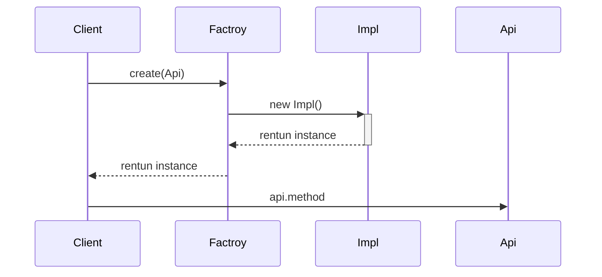

## 7个原则

- 单一职责原则【SINGLE RESPONSIBILITY PRINCIPLE】: 一个类负责一项职责。
- 里氏替换原则【LISKOV SUBSTITUTION PRINCIPLE】: 继承与派生的规则。
- 依赖倒置原则【DEPENDENCE INVERSION PRINCIPLE】: 高层模块不应该依赖低层模块，二者都应该依赖其抽象；抽象不应该依赖细节；细节应该依赖抽象。
即针对接口编程，不要针对实现编程。
- 接口隔离原则【INTERFACE SEGREGATION PRINCIPLE】: 
- 建立单一接口，不要建立庞大臃肿的接口，尽量细化接口，接口中的方法尽量少。
- 迪米特法则【LOW OF DEMETER】: 低耦合，高内聚。
- 开闭原则【OPEN CLOSE PRINCIPLE】: 一个软件实体如类、模块和函数应该对扩展开放，对修改关闭。
- 组合/聚合复用原则【Composition/Aggregation Reuse Principle(CARP) 】: 尽量使用组合和聚合少使用继承的关系来达到复用的原则。

## 24设计模式

### 创建型模式

- 单例模式【Singleton Pattern】:确保一个类只有一个实例，并提供该实例的全局访问点
- 简单工厂【Simple Factory Pattern】: 由一个工厂对象决定创建出哪一种产品类的实例

#### 单例模式

- 双重校验锁实现

`volatile`关键字的作用是确保多个线程正确处理某个共享的变量，确保当 uniqueInstance 被初始化为新的 Singleton 实例时，所有线程能够立即看到这个变化。

```java
public class Singleton {

    private volatile static Singleton uniqueInstance;

    private Singleton() {
    }

    public static Singleton getUniqueInstance() {
        if (uniqueInstance == null) {
            synchronized (Singleton.class) {
                if (uniqueInstance == null) {
                    uniqueInstance = new Singleton();
                }
            }
        }
        return uniqueInstance;
    }
}
```

- 枚举类方式实现

```java
public enum Singleton {
    uniqueInstance;
}
```

枚举类方式实现方式是单例模式的最佳实现：
  - 线程安全：枚举类在实例加载时初始化，因此线程安全。
  - 防止反序列化时创建新的对象：枚举类默认继承了`java.io.Serializable`接口，因此枚举类在序列化和反序列化时不会创建新的对象。
  - 防止反射攻击：枚举类的构造函数是私有的，因此无法通过反射调用构造函数创建新的对象。

- 静态内部类实现

```java
public class Singleton {

    private Singleton() {
    }

    private static class SingletonHolder {
        private static final Singleton INSTANCE = new Singleton();
    }

    public static Singleton getUniqueInstance() {
        return SingletonHolder.INSTANCE;
    }
}
```

- 延迟加载：只有在调用`getUniqueInstance`方法时才会加载`SingletonHolder`类，才会创建`Singleton`实例。但这种方式并不是完美的，如果一个类的实例化非常耗时，那么在首次调用`getUniqueInstance`方法时会有一定的延迟。
- 线程安全：Java 中对类的初始化在多线程环境下是线程安全的。
- 防止反序列化和反射攻击：由于`SingletonHolder`类没有外部引用，因此无法通过反序列化或者反射来创建新的实例，从而避免了反序列化和反射攻击。


> 使用双重校验锁实现`public class Singleton`类是公有的，可以通过反射获取到该类的构造函数，将其设为`public`从而创建新的实例。具体如下：

  ```java
  public static void main(String[] args) {
        try {
            // 获取 Singleton 类的构造函数对象
            Constructor<Singleton> constructor = Singleton.class.getDeclaredConstructor();
            
            // 将构造函数设置为可访问
            constructor.setAccessible(true);
            
            // 使用构造函数创建新的 Singleton 实例
            Singleton instance = constructor.newInstance();
        } catch (Exception e) {
            e.printStackTrace();
        }
    }
  ```

  而使用静态内部类实现，类`private static class SingletonHolder`是私有的，无法通过反射获取到该类的构造函数，因此无法通过反射创建新的实例。

#### 简单工厂

> [https://www.jianshu.com/p/a9f397c4ff98](https://www.jianshu.com/p/a9f397c4ff98)

在创建一个对象时不向客户端暴露内部细节，并提供一个创建对象的通用接口。将对象的实例化全部放到一个类中来操作。

- 定义接口

```java
/**
   * 接口的定义，该接口可以通过简单工厂来创建
   */  
public interface Api {  
     /**
      * 示意，具体的功能方法的定义
      * @param s 示意，需要的参数
      */  
     public void operation(String s);  
}  
```

- 接口实现类

```java
/**
   * 接口的具体实现对象A
   */  
public class ImplA implements Api{  
     public void operation(String s) {  
         //实现功能的代码，示意一下  
         System.out.println("ImplA s=="+s);  
     }  
}  

/**
   * 接口的具体实现对象B
   */  
public class ImplB implements Api{  
     public void operation(String s) {  
         // 实现功能的代码，示意一下  
         System.out.println("ImplB s=="+s);  
     }  
}  
```

- 工厂类，用来创造Api对象
```java
public class Factory {  
     /**
      * 具体的创造Api对象的方法
      * @param condition 示意，从外部传入的选择条件
      * @return 创造好的Api对象
      */  
     public static Api createApi(int condition){  
         //应该根据某些条件去选择究竟创建哪一个具体的实现对象，  
         //这些条件可以从外部传入，也可以从其它途径获取。  
         //如果只有一个实现，可以省略条件，因为没有选择的必要。  

         //示意使用条件  
         Api api = null;  
         if(condition == 1) {  
             api = new ImplA();  
         } else if(condition == 2) {  
             api = new ImplB();  
         }  
         return api;  
     }  
}  
```

- 客户端，使用Api接口
```java  
public class Client {  
     public static void main(String[] args) {  
         //通过简单工厂来获取接口对象  
         Api api = Factory.createApi(1);  
         api.operation("正在使用简单工厂");  
     }  
}  
```



#### 工厂方法

> https://www.jianshu.com/p/f1960652b64b

父类在不知道方法具体实现的情况下完成方法调用，具体方法实现由子类完成

实现步骤：

1. 定义工厂类（父类）：父类通常是一个抽象类，也可以是interface或class，包含工厂方法，即每个产品都需要实现的方法（默认方法）。
2. 工厂类中的产品的具体实现。


一个具体的例子

- 定义工厂

```java
/**
 * 导出的文件对象的接口
 */
public interface ExportFileApi {
   /**
    * 导出内容成为文件
    * @param data 示意：需要保存的数据
    * @return 是否导出成功
    */
   public boolean export(String data);
}
```

- 定义工厂要生产的具体内容（方法的具体实现）

```java
/**
   * 导出成文本文件格式的对象
   */
public class ExportTxtFile implements ExportFileApi{
      public boolean export(String data) {
          //简单示意一下，这里需要操作文件
          System.out.println("导出数据"+data+"到文本文件");
          return true;
      }
}

/**
   * 导出成数据库备份文件形式的对象
   */
public class ExportDB implements ExportFileApi{
      public boolean export(String data) {
          //简单示意一下，这里需要操作数据库和文件
          System.out.println("导出数据"+data+"到数据库备份文件");
          return true;
      }
}
```

- 创建器，用于创建工厂生产内容的实现

```java
/**
   * 实现导出数据的业务功能对象
   */
public abstract class ExportOperate {
      /**
       * 导出文件
       * @param data 需要保存的数据
       * @return 是否成功导出文件
       */
      public boolean export(String data){
          //使用工厂方法
          ExportFileApi api = factoryMethod();
          return api.export(data);
      }
      /**
       * 工厂方法，创建导出的文件对象的接口对象
       * @return 导出的文件对象的接口对象
       */
      protected abstract ExportFileApi factoryMethod();
}
```

- 创建器的具体实现

```java
/**
   * 具体的创建器实现对象，实现创建导出成文本文件格式的对象
   */
public class ExportTxtFileOperate extends ExportOperate{
      protected ExportFileApi factoryMethod() {
          //创建导出成文本文件格式的对象
          return new ExportTxtFile();
      }
}

/**
   * 具体的创建器实现对象，实现创建导出成数据库备份文件形式的对象
   */
public class ExportDBOperate extends ExportOperate{
      protected ExportFileApi factoryMethod() {
          //创建导出成数据库备份文件形式的对象
          return new ExportDB();
      }
}
```

- 使用

```java
public class Client {
      public static void main(String[] args) {
          //创建需要使用的Creator对象
          ExportOperate operate = new ExportDBOperate();
          //调用输出数据的功能方法
          operate.export("测试数据");
      }
}
```

